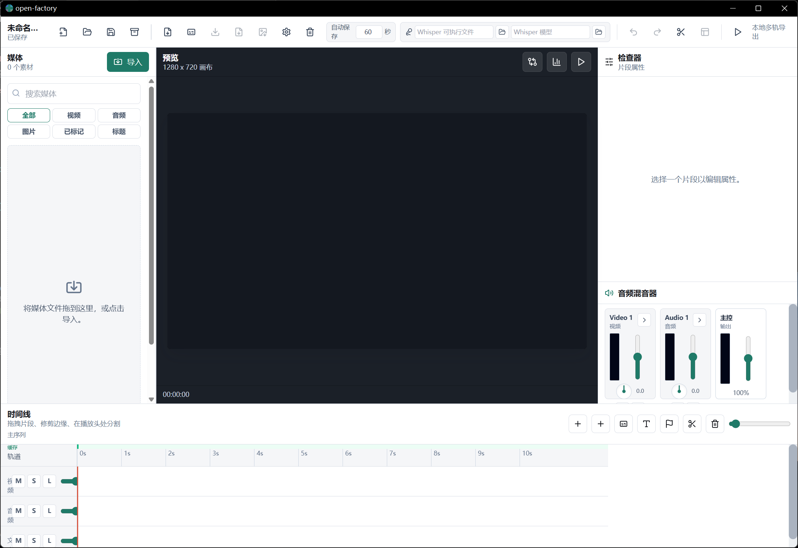

# 开源工厂 (Open Factory)

[](LICENSE)

[](https://github.com/a137460387/open-factory/releases)
[](https://bun.sh)
[](https://www.rust-lang.org)
[](https://www.typescriptlang.org)
[](https://tauri.app)

**本地优先的专业桌面视频编辑器** — 基于 Tauri 2、Rust、React、TypeScript 构建，支持 AI 智能编辑和插件扩展。零登录、零遥测、零云端上传，所有媒体文件与项目数据始终保留在您的本地设备上。



---

## 🎯 项目定位

Open Factory 是一款面向专业创作者的**本地化优先**视频编辑器，提供从剪辑、调色、混音到导出的完整后期制作工作流。项目以隐私保护为核心设计原则，不收集任何用户数据，所有处理均在本地完成。

---

## ✨ 核心特性

### 🎬 专业剪辑引擎

- **多轨时间线** — 视频、音频、图片、文字 Clip，支持移动、裁剪、分割、删除
- **高级剪辑操作** — 波纹删除、滑移（Slip）、滑行（Slide）、嵌套序列、多机位剪辑
- **撤销/重做系统** — 所有编辑操作通过 Command Objects 实现，支持完整操作历史
- **关键帧动画** — 不透明度、音量、位置、缩放、变速曲线，支持贝塞尔/线性/步进插值
- **分屏布局与画中画** — 灵活的多画面组合方式
- **故事板模式** — 快速排列素材，生成粗剪序列

### 🎨 专业调色系统

- **节点式调色引擎** — 基于 Kahn 拓扑排序的节点图，支持 WebGL 片段着色器生成
- **一级校色** — Lift/Gamma/Gain 三向色轮 + 滑块控制
- **曲线编辑器** — RGB 分通道曲线调整
- **HSL 限定器** — 精准的二级调色，基于色相/饱和度/亮度选取
- **LUT 管理** — `.cube` 文件解析与加载，内置 Camera Log → Rec.709 转换 LUT
- **窗口遮罩** — 形状遮罩与路径遮罩，支持局部调色
- **色彩示波器** — 波形图、矢量示波器、直方图

### 🎵 专业音频混音

- **完整混音器架构** — 多通道 Mixer，支持 Submix/Send/Aux/Master 总线路由
- **20 种音频效果** — 4/8 段参数 EQ、压缩器、限制器、噪声门、混响、延迟、合唱、镶边、去齿音、降噪等
- **AI 语音降噪** — 基于 nnnoiseless 的本地 AI 降噪引擎，支持强度 0.0-1.0 混合调节
- **自动化曲线** — 支持 Read/Write/Touch/Latch 模式，线性/贝塞尔/步进插值
- **VU 电平表** — 峰值/RMS 电平监测
- **音频闪避** — 侧链压缩实现自动闪避
- **3D 空间音频** — KEMAR HRTF 支持，房间模型（小房间/大厅/户外），双耳渲染
- **对白检测** — 自动识别对白/音乐/静音段落
- **说话人分离** — 基于音频特征的说话人识别

### 🤖 AI 创作引擎

- **AI 智能混剪** — 节拍感知的智能素材编排，自动生成节奏匹配的混剪序列
- **AI 自动字幕** — 四阶段工作流（语音识别 → 润色 → 样式 → 导出），支持 SRT/ASS/VTT
- **本地字幕生成** — Whisper.cpp 集成，支持 SRT/ASS/VTT 导出，带进度报告
- **AI 语音降噪** — 基于 nnnoiseless 的本地 AI 降噪，支持强度调节与实时预览
- **AI 场景检测** — 色彩直方图 + 运动矢量的自适应阈值场景分析
- **智能粗剪** — AI 驱动的粗剪编排，支持算法模式与一键应用
- **多模型 AI 代理** — 支持 15+ AI 提供商（OpenAI、Anthropic、Gemini、DeepSeek、GLM、Qwen、Kimi、Ollama 等）
- **智能推荐** — 转场推荐、B-roll 建议、节奏分析、音量标准化建议
- **叙事分析** — 故事结构分析、情感检测、角色时间线追踪
- **AI 重构图** — 智能适配不同平台的画幅比例
- **语音理解** — 语音转文字、情感分析、语调检测
- **智能色彩** — 色彩一致性校正、Look 匹配、降噪建议
- **AI 媒体管理** — 自动标签、语义搜索、媒体智能整理

### 🔄 专业互操作性

- **FCPXML 导入/导出** — 完整的 Final Cut Pro XML (xmeml v4) 格式支持
- **CMX 3600 EDL** — 标准 EDL 格式导入/导出，支持溶解转场与时间码解析
- **AAF/OMF 导出** — 与 Avid、Pro Tools 等专业工具的项目交换
- **智能媒体匹配** — 精确路径匹配 + 模糊名称匹配（Token 重叠评分）
- **色彩校正元数据** — FCP XML 导出中嵌入调色信息

### 🎥 视频特效栈

- **内置特效** — 模糊、锐化、暗角、胶片颗粒、色散、运动模糊
- **自定义 GLSL 着色器** — 支持 `u_texture`、`u_resolution`、`u_time`、`u_progress` Uniform
- **混合模式** — 多种图层混合模式合成
- **抠像系统** — 色度键、亮度键、差值遮罩
- **帧插值** — FFmpeg minterpolate 集成

### 📦 导出与分发

- **多格式导出** — MP4、GIF、WebP、APNG、PNG 序列、当前帧
- **DAG 导出管线** — 节点式导出流水线（质量检查、脚本钩子、WebDAV 上传、通知、平台发布）
- **GPU 硬件编码** — NVENC (NVIDIA) / VideoToolbox (macOS) 加速
- **硬件加速解码** — CUDA / VAAPI / QuickSync / D3D11VA / VideoToolbox，自动检测与软件降级
- **渲染农场** — 分布式渲染支持
- **渐进式导出** — 边渲染边预览
- **批量导出** — 序列批量导出与版本化批处理
- **多平台分发** — 平台预设、智能裁切、发布调度器
- **质量评估** — VMAF 导出后质量检测

### 🔌 插件与自动化

- **插件系统** — Worker 隔离沙箱执行，权限守卫，插件市场
- **宏录制与回放** — 记录编辑操作序列，批量回放
- **自动化规则** — 条件触发的自动化工作流
- **脚本支持** — 导出前后脚本钩子

### 🛡️ 项目管理

- **自动保存与崩溃恢复** — 项目状态自动持久化
- **快照版本管理** — 项目历史快照，随时回溯
- **项目归档** — 完整项目打包与分享
- **项目健康检查** — 项目完整性诊断
- **SQLite 媒体索引** — 本地媒体数据库，支持快速检索
- **项目加密** — AES-GCM 加密保护敏感项目
- **WebDAV 备份** — 远程备份与同步

### 🎙️ 媒体工具

- **屏幕录制** — 通过 FFmpeg 实现屏幕与摄像头录制
- **人声分离** — Demucs 集成，分离人声与伴奏
- **波形生成** — 音频波形可视化
- **静音检测** — 自动识别静音段落
- **节拍检测** — 音乐节拍分析，支持节奏对齐剪辑
- **媒体转码** — 批量媒体格式转换

### 🌐 协作与安全

- **实时协作** — WebSocket 基础的多人协作
- **共享媒体库** — 团队素材共享
- **SSRF 防护** — 网络请求安全校验
- **路径验证** — 文件路径安全检查
- **隐私区域检测** — 自动识别敏感区域

---

## 🗺️ 功能全景

项目已实现 **15 大类、200+ 功能点**，覆盖专业视频后期制作的完整工作流：

| 模块 | 核心能力 |
|------|---------|
| 🎬 核心剪辑 | 多轨时间线、波纹删除、变速、关键帧动画、撤销树、片段组 |
| 🤖 AI 智能创作 | 45+ AI 功能（粗剪/字幕/调色/降噪/B-roll/蒙太奇/导演模式…）、15+ AI 提供商 |
| 🎨 画面效果与调色 | 节点式调色、色彩轮、HSL 限定器、LUT、GLSL 着色器、抠像、帧插值 |
| 🎵 音频处理 | 20 种效果、混音器、Demucs 人声分离、3D 空间音频、节拍检测 |
| 📝 字幕系统 | Whisper ASR、多语言、翻译、校对、阅读速度、数据字幕 |
| 📁 媒体管理 | 媒体库/文件夹/标签/评分/版本、代理文件、SQLite FTS5 索引 |
| 🚀 渲染与分发 | FFmpeg 管线、GPU 编码、渐进式导出、渲染农场、WebDAV 上传 |
| 🔄 专业互操作 | FCPXML / CMX 3600 EDL / AAF 导入导出 |
| 🎭 多机位编辑 | 多角度同步、实时切换、AI 推荐切换点 |
| 📋 项目管理 | 快照、模板、加密(AES-GCM)、健康检查、WebDAV 备份 |
| ⚙️ 底层架构 | 115 个 Tauri 命令、硬件编解码、SSRF 防护、系统钥匙串 |
| 🧩 插件与自动化 | 插件系统、宏、操作录制、自动化规则、脚本 |
| 🎨 界面与体验 | 4 种主题、3+6 工作区布局、中英文国际化、教程引导 |
| 🤝 协作与分享 | WebSocket 协作、注释、权限、分享包、共享素材库 |
| 🛠️ 高级工具 | 运动跟踪、隐私检测、屏幕录制、批量转码/水印、审阅模式 |

> 📄 完整功能清单（含状态标记与技术亮点）：[docs/feature-inventory.md](docs/feature-inventory.md)

---

## 🚀 版本亮点

### v4.21.0 — 专业互操作性

- ✅ **FCPXML 导入/导出** — 与 Final Cut Pro 无缝项目交换
- ✅ **CMX 3600 EDL** — 标准 EDL 格式完整支持
- ✅ **AAF/OMF 导出** — 与 Avid、Pro Tools 专业工具互操作
- ✅ **智能媒体匹配** — 自动关联缺失素材文件
- ✅ **全面 E2E 测试** — 互操作性端到端测试覆盖

### v4.23.0 — 硬件加速解码

- ✅ **多后端支持** — CUDA / VAAPI / QuickSync / D3D11VA / VideoToolbox
- ✅ **自动检测** — 智能识别可用 GPU 硬件
- ✅ **软件降级** — 硬件解码失败时自动回退到软件解码
- ✅ **批量帧解码** — 预览管线集成的批量解码优化

### v4.26.0 — 架构重构与模块化

- ✅ **Store 层重构** — 2 个 God Store 拆分为 8 个功能域 Store，Zustand DevTools 调试效率大幅提升
- ✅ **超大组件拆分** — Timeline.tsx (7,626→817 行) 和 Inspector.tsx (8,082→310 行) 模块化
- ✅ **超大逻辑文件拆分** — ffmpeg-builder (5,215行→8模块)、model (2,713行→6模块)、tauri-bridge (2,520行→7模块)
- ✅ **性能优化** — Timeline/Inspector 独立 lazy chunk 按需加载，React.memo 精确渲染控制
- ✅ **向后兼容** — 所有旧 import 路径通过 barrel re-export 保持可用
- ✅ **测试覆盖** — 5,257 单元测试，editor-core 覆盖率 97.94%

### v4.25.4 — 安全审计与工程质量提升

- ✅ **全量代码审计** — 完成 100 个问题的四维度审计（安全、架构、业务逻辑、性能）
- ✅ **Critical 安全修复** — WebDAV 密码迁移到系统 keyring，中文分词修复
- ✅ **High 安全加固** — Asset Protocol scope 收窄、CSP 增强、nonce 安全
- ✅ **业务逻辑修复** — TF-IDF 公式、导出资源清理、轨道锁定检查等 8 项
- ✅ **Prettier 格式化** — 全项目代码风格统一
- ✅ **文档完善** — README、CONTRIBUTING、DEVELOPMENT 文档更新
- ✅ **测试覆盖提升** — 核心模块单元测试补充
- ✅ **依赖清理** — 移除冗余依赖，统一版本管理

### v4.25.3 — 应用内语言切换

- ✅ **语言切换** — 支持中文/英文界面切换，设置即时生效

### v4.25.2 — 错误处理与依赖优化

- ✅ **统一错误处理** — 引入 `logError` 工具函数
- ✅ **Rust 依赖瘦身** — `once_cell` → `LazyLock`，统一 zip 库版本
- ✅ **前端依赖整理** — Radix UI 组件库迁移与清理

### v4.25.1 — 稳定性修复

- ✅ **AI 内存泄漏修复** — 优化 AI 模型资源释放逻辑
- ✅ **DB 连接池优化** — 修复连接泄漏和超时回收问题
- ✅ **E2E 测试恢复** — AI 降噪与多机位测试稳定性提升

### v4.25.0 — AI 智能创作与性能优化

- ✅ **AI 智能混剪** — 节拍感知的自动素材编排，生成节奏匹配的混剪序列
- ✅ **AI 自动字幕** — 四阶段工作流（ASR → 润色 → 样式 → 导出）
- ✅ **AI 语音降噪** — 从 rnnoise-rs 迁移至 nnnoiseless，支持本地与云端降噪
- ✅ **硬件加速编码** — GPU 编码器自动选择（NVENC / VideoToolbox 等）
- ✅ **多机位剪辑 MVP** — 多角度同步与切换，含切换点编辑
- ✅ **大型项目性能优化** — 时间线虚拟化与缓存，支持 1000+ Clip 项目
- ✅ **智能媒体库** — 元数据提取、列表视图、编解码器/帧率/码率列排序
- ✅ **E2E 测试修复** — 恢复 13 个历史失败/跳过的测试

---

## 🔒 安全

Open Factory 重视安全，采用本地优先架构保护用户数据。所有媒体文件和项目数据始终保留在本地设备上。

### 安全特性

- **系统钥匙串集成** — WebDAV 密码等敏感凭据通过操作系统原生 keyring 安全存储
- **路径安全验证** — 所有文件操作经过规范化、父目录遍历检查、符号链接逃逸检测
- **SSRF 防护** — 网络请求经过严格的安全校验
- **DOMPurify 消毒** — 所有用户内容经过 XSS 过滤
- **AES-256-GCM 加密** — 项目文件支持端到端加密
- **CSP 策略** — 内容安全策略限制外部资源加载
- **最小权限原则** — Asset Protocol scope 仅限必要目录

### 安全审计

项目定期进行全量安全审计，确保代码质量和安全性：

| 审计日期 | 版本 | 问题数 | 状态 |
|----------|------|--------|------|
| 2026-07-15 | v4.25.4 | 100 | ✅ Critical/High 全部修复 |
| 2026-07-03 | v4.25.0 | 42 | ✅ 建立审计基线 |

### 持续安全监控

- **CI/CD 集成** — 每次提交自动运行 `bun audit` 和 `cargo audit`
- **每周扫描** — 定时运行依赖漏洞检查
- **月度审计** — 定期全量审计对比问题清单

> 📄 详细安全信息请参阅：[SECURITY.md](SECURITY.md)
> 📄 审计报告与修复记录：[docs/audit/](docs/audit/)

---

## 📐 项目架构

```
open-factory/
├── apps/
│   └── desktop/              # Tauri 桌面应用
│       ├── src/              # React + TypeScript 前端
│       └── src-tauri/        # Rust 后端 (Tauri Commands)
├── packages/
│   ├── editor-core/          # 纯 TypeScript 核心编辑逻辑
│   │   ├── src/
│   │   │   ├── audio/        # 音频混音与效果
│   │   │   ├── color-grading/# 调色引擎
│   │   │   ├── commands/     # 撤销/重做系统
│   │   │   ├── distribution/ # 多平台分发
│   │   │   ├── export/       # 导出管线
│   │   │   ├── subtitles/    # 字幕处理
│   │   │   └── ...           # 200+ 功能模块
│   │   └── __tests__/        # 单元测试 (≥80% 覆盖率)
│   └── plugin-sdk/           # 插件 API 类型定义
├── tools/
│   └── create-plugin/        # 插件脚手架工具
├── docs/                     # 架构文档、路线图、设计目标
├── scripts/                  # 媒体兼容性测试、性能基准
└── apps/desktop/e2e/         # Playwright 端到端测试
```

**技术栈：**

| 层级 | 技术 |
|------|------|
| 前端框架 | React + TypeScript |
| 桌面运行时 | Tauri 2 (WebView2) |
| 后端语言 | Rust |
| 包管理器 | Bun |
| 预览渲染 | WebGL + Web Audio |
| 视频处理 | FFmpeg |
| 本地 AI | Whisper.cpp + Ollama |
| 数据库 | SQLite |
| 测试框架 | Vitest + Playwright |

---

## 📚 文档

- [架构设计](docs/architecture.md)
- [开发路线图](docs/roadmap.md)
- [设计目标](docs/design-goals.md)
- [产品计划](docs/product-plan.md)
- [功能全景清单](docs/feature-inventory.md)

---

## 🛠️ 开发环境设置

### 环境要求

- **Bun** >= 1.3 — JavaScript 运行时与包管理器
- **Rust** stable >= 1.77 — Tauri 后端编译
- **FFmpeg** — 需在系统 PATH 中，用于视频/音频处理
- **Windows** — WebView2 Runtime + Visual Studio C++ Build Tools
- **macOS** — Xcode Command Line Tools
- **Linux** — WebKitGTK 开发库

### 快速开始

```bash
# 1. 克隆仓库
git clone https://github.com/a137460387/open-factory.git
cd open-factory

# 2. 安装依赖
bun install

# 3. 启动开发服务器
bun run tauri:dev
```

## 📏 代码规范

本项目使用 [Prettier](https://prettier.io) 进行代码格式化。提交代码前请确保格式正确：

```bash
# 自动格式化代码
bun run format

# 检查格式是否符合规范（CI 中会运行此检查）
bun run format:check
```

格式化范围覆盖 `packages/editor-core/src/**/*.ts` 和 `apps/desktop/src/**/*.{ts,tsx}`。

## 🚀 开发

```bash
# 启动开发服务器
bun run tauri:dev

# 类型检查
bun run typecheck

# 运行单元测试
bun run test

# 运行端到端测试
bun run e2e

# 发布检查
bun run check:release
```

## 📦 构建

```bash
# 构建生产版本
bun run tauri:build

# 原生冒烟测试
bun run smoke:tauri
```

## 🔌 创建插件

```bash
bun run create-plugin
```

---

## 🤝 贡献

欢迎贡献！请遵循以下流程：

1. Fork 本仓库
2. 创建功能分支 (`git checkout -b feature/amazing-feature`)
3. 提交更改 (`git commit -m 'feat: add amazing feature'`)
4. 推送到远程 (`git push origin feature/amazing-feature`)
5. 创建 Pull Request

**开发规范：**

- 所有 Tauri invoke/listen/dialog/shell 调用必须通过 `tauri-bridge.ts`
- FFmpeg 执行必须使用参数数组，禁止 shell 字符串拼接
- 核心算法必须有 Vitest 覆盖，`packages/editor-core` 覆盖率不低于 80%
- 大文件处理必须保持异步，不得阻塞 UI 线程
- Timeline 修改必须通过 Command Objects

---

## 📄 许可证

[MIT License](LICENSE) — Copyright (c) 2024 Contributors

---

## 🔗 链接

- [GitHub 仓库](https://github.com/a137460387/open-factory)
- [问题反馈](https://github.com/a137460387/open-factory/issues)
- [版本发布](https://github.com/a137460387/open-factory/releases)
